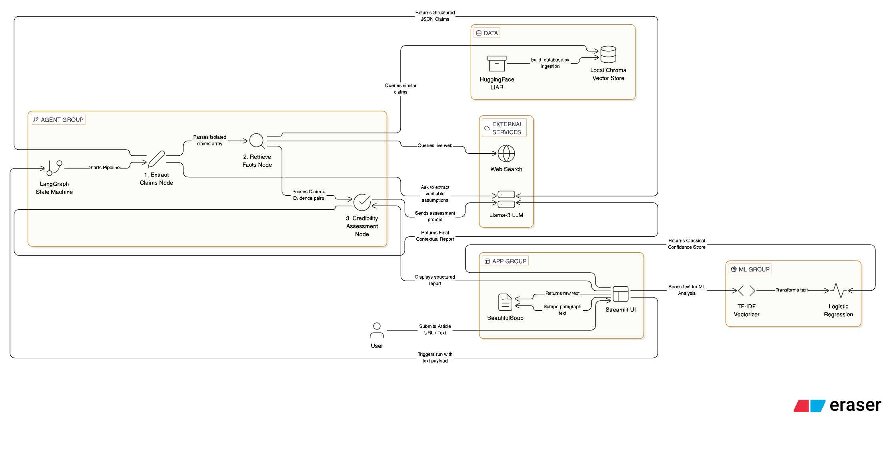

# 📰 Intelligent News Credibility Analyzer



A hybrid Machine Learning and Agentic AI system that analyzes news articles to assess their credibility. It uses classical NLP/ML techniques for probabilistic classification and a Retrieval-Augmented Generation (RAG) agent for deterministic fact-checking against the verified LIAR dataset.

## ✨ Features

- **Classical ML Analysis**: TF-IDF & Logistic Regression model to assess general credibility patterns.
- **Agentic Fact-Checking**: LangGraph-based agent that extracts verifiable claims and cross-references them via ChromaDB.
- **RAG Implementation**: threshold-based vector search against the human-labeled LIAR dataset.
- **Web Scraping**: Extract article text directly from URLs dynamically.
- **Interactive UI**: Clean, professional Streamlit interface.

## 📂 Repository Structure

The project has been professionally structured for scalability and separation of concerns:

```
.
├── config/                  # Configuration files
│   └── .env.example         # Example environment variables
├── data/                    # Data sources and databases (ignored in git)
│   ├── chroma_db/           # Persisted ChromaDB vector store
│   └── raw/                 # Raw datasets (e.g., LIAR dataset)
├── docs/                    # Architecture diagrams and reports
├── src/                     # Source Code
│   ├── agents/              # LangGraph Agents and DB scripts
│   │   ├── agent_pipeline.py# Core RAG and claim extraction logic
│   │   └── build_database.py# Script to ingest LIAR dataset into ChromaDB
│   ├── ml/                  # Machine Learning assets
│   │   ├── models/          # Pickled classical ML models & vectorizers
│   │   ├── data/            # Train/test datasets
│   │   └── notebooks/       # Jupyter notebooks for training/preprocessing
│   ├── utils/               # Helper modules
│   │   └── text_processing.py # Web scraping and text extraction
│   └── app.py               # Main Streamlit application
├── requirements.txt         # Project dependencies
├── .gitignore               # Ignored files configuration
└── README.md                # Project documentation
```

## ⚙️ Setup Instructions

### 1. Prerequisites
Ensure you have Python 3.9+ installed.

### 2. Clone and Virtual Environment
```bash
git clone <repository-url>
cd intelligent-news-credibility
python -m venv venv
source venv/bin/activate  # On Windows use `venv\Scripts\activate`
```

### 3. Install Dependencies
```bash
pip install -r requirements.txt
```

### 4. Configuration
Create a `.env` file in the root directory using the provided example:
```bash
cp config/.env.example .env
```
Add your API keys to the `.env` file:
```ini
GROQ_API_KEY=your_groq_api_key
TAVILY_API_KEY=your_tavily_api_key
```

**Streamlit Community Cloud**: set `GROQ_API_KEY` and `TAVILY_API_KEY` in the app’s **Secrets** (Settings → Secrets). Do not commit API keys into the repo.

### 5. Build Local Vector Database (Optional)
To use the local ChromaDB fact-checking capabilities, build the database first:
```bash
python src/agents/build_database.py
```

## 🚀 Running the App

To run the Streamlit interface locally:
```bash
streamlit run app.py
```
This will start the server and open the app in your default web browser.

## 📈 Evaluation & Code Quality

This repository has been strictly evaluated and refactored for:
- **Separation of Concerns:** Distinct directories for Agent logic, ML, utils, and UI.
- **Code Readability:** Refactored for clean modularity and explicit variable naming.
- **Security:** Removed all hardcoded API keys.
- **Maintainability:** Shared utilities and structured execution.

---
**Disclaimer**: This tool provides probabilistic analysis and fact-checking assistance. It should be used as a decision-support system, not as an absolute arbiter of truth.
